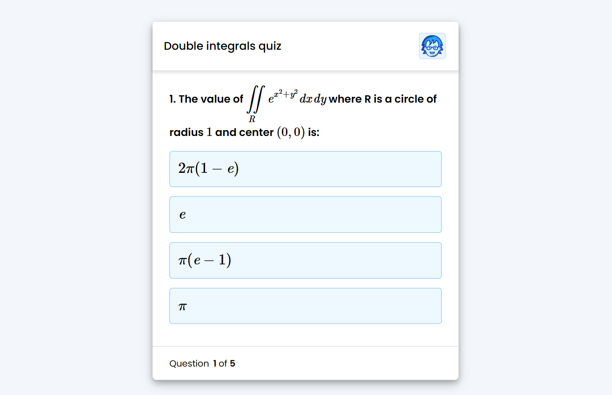

# Quiz app with LaTeX rendering

This is an interactive quiz app with LaTeX rendering, perfect for including in websites related to Mathematics or Physics. 

## Table of contents

- [Overview](#overview)
  - [Instructions](#instructions)
  - [Screenshot](#screenshot)
  - [Links](#links)
- [My process](#my-process)
  - [Built with](#built-with)
- [Author](#author)


## Overview

## Instructions
1. This app requires [MathJax](https://www.mathjax.org/#gettingstarted) to render LaTeX

2. questions.js holds the questions, question number, options, and answers

3. Inline equations can be rendered by enclosing them in the following way:  

```js
$latex x+5$ 
//or 
\\(x+5\\)
```

4. For equations that require backslash, use two backslashes in each instance as JS skips over one. Examples: 

```js
$latex \\frac{1}{2}$ 
$latex \\int f(x) dx$
```

### Screenshot



### Links

- Live Site URL: [https://jefferh30.github.io/Quiz-App-with-LaTeX-rendering/](https://jefferh30.github.io/Quiz-App-with-LaTeX-rendering//)

## My process

### Built with

- Semantic HTML5 markup
- CSS custom properties
- Simple JavaScript
- MathJax

## Author

- Website - [Jefferson Huera](https://www.neurochispas.com)
